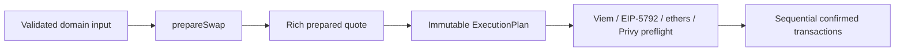

# Osero TypeScript SDK

Nx/pnpm workspace for `@osero/client`, the production SDK for preparing and executing USDC, USDS, and sUSDS swaps across Ethereum, OP Mainnet, Unichain, Base, and Arbitrum One.

The v1 design is plan-first:



## Install

```bash
pnpm add @osero/client viem
```

Optional executor peers:

```bash
pnpm add ethers
pnpm add @privy-io/node
```

Node.js 20 or newer and ESM are required.

## Prepare and execute

```ts
import { OseroClient, tokenAmount } from '@osero/client';
import { prepareSwap } from '@osero/client/actions';
import { sendWith } from '@osero/client/viem';
import { createWalletClient, http, parseUnits } from 'viem';
import { privateKeyToAccount } from 'viem/accounts';
import { base } from 'viem/chains';

const transport = http(process.env.BASE_RPC_URL);
const account = privateKeyToAccount(process.env.PRIVATE_KEY as `0x${string}`);
const client = OseroClient.create({ transports: { 8453: transport } });
const wallet = createWalletClient({ account, chain: base, transport });
const amountIn = tokenAmount('USDC', parseUnits('100', 6));
if (amountIn.isErr()) throw amountIn.error;

const prepared = await prepareSwap(client, {
  chainId: 8453,
  account: account.address,
  mode: 'exact-in',
  amountIn: amountIn.value,
  assetOut: 'sUSDS',
  approvalPolicy: 'exact',
});

if (prepared.isErr()) {
  console.error(prepared.error.code, prepared.error.toJSON());
} else {
  console.log(prepared.value.expectedAmountOut);
  console.log(prepared.value.minimumAmountOut);
  console.log(prepared.value.plan.steps);

  const executed = await sendWith(wallet, prepared.value.plan, {
    confirmations: 2,
  });
  if (executed.isErr()) {
    console.error(executed.error.code, executed.error.execution);
  } else {
    console.log(executed.value.transactions);
  }
}
```

Operational APIs return typed `Result`/`ResultAsync` values. Executor adapters validate the entire plan, connected account, chain, options, and capabilities before transaction 1. Approval defaults are allowance-aware and exact; referral attribution and public RPC fallback are disabled unless explicitly enabled.

## Public packages

| Import                    | Contract                                                           |
| ------------------------- | ------------------------------------------------------------------ |
| `@osero/client`           | Client, domain values, plans, errors, reads, chain/token discovery |
| `@osero/client/actions`   | Local swap preparation and honest simulation                       |
| `@osero/client/api`       | Hosted quotes and cross-chain completion polling                   |
| `@osero/client/contracts` | Supported ABIs and protocol addresses                              |
| `@osero/client/viem`      | viem executor                                                      |
| `@osero/client/eip5792`   | EIP-5792 atomic batch executor with sequential fallback            |
| `@osero/client/ethers`    | ethers v6 executor                                                 |
| `@osero/client/privy`     | Privy server-wallet executor                                       |

See [`packages/client/README.md`](packages/client/README.md) for the full API, exact-output preparation, approval policies, hosted API verification, execution recovery, simulation semantics, and security guidance.

## Workspace

```text
packages/client/       SDK source, tests, package metadata, and API report
examples/              Runnable read-only and wallet-adapter examples
docs/osero-sdk/        Design and release audit material
.github/workflows/     CI, pinned-fork, package, and publication gates
scripts/               Deterministic clean-build and package validation scripts
```

## Development

```bash
pnpm install
pnpm nx build @osero/client
pnpm nx typecheck @osero/client
pnpm nx test @osero/client
pnpm --filter @osero/client test:coverage
pnpm lint
pnpm format:check
```

Release-integrity checks:

```bash
pnpm api:report:check
pnpm package:validate
pnpm release:verify
```

`package:validate` creates a deliberate stale build artifact, performs a clean build, checks the declaration API report and tarball allowlist, installs the actual tarball into an isolated consumer, resolves every public ESM/types entrypoint, verifies removed imports remain unavailable, and confirms root/API imports work without optional wallet peers.

Pinned fork tests run against fixed blocks on all five supported chains in CI/release. They verify deployed bytecode, configured read ABIs, quote math, real plan preparation, and non-broadcasting transaction simulation.

## Safe examples

```bash
pnpm --filter @osero/examples dry-run:inspect-plan
pnpm --filter @osero/examples dry-run:susds-apy
OSERO_API_KEY=osero_... pnpm --filter @osero/examples api:quote-swap
```

Wallet examples can broadcast real transactions. Use explicit RPC URLs, disposable keys, and small balances.

## License

MIT. See [`LICENSE`](LICENSE).
